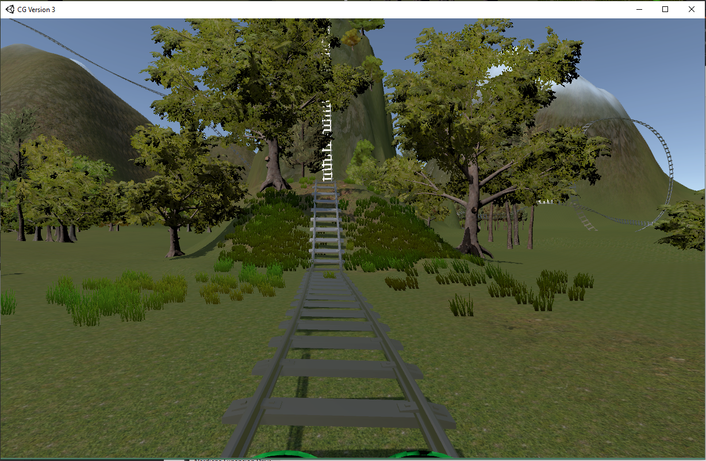
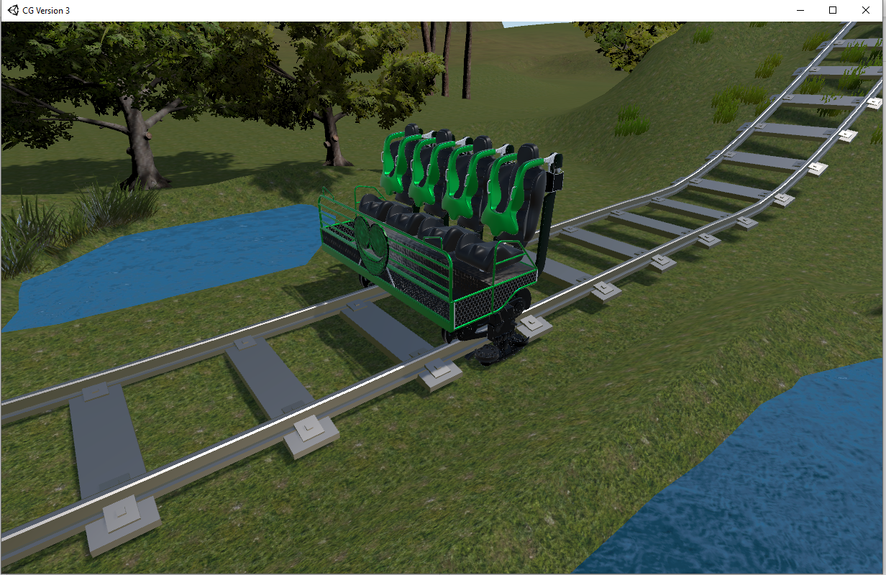
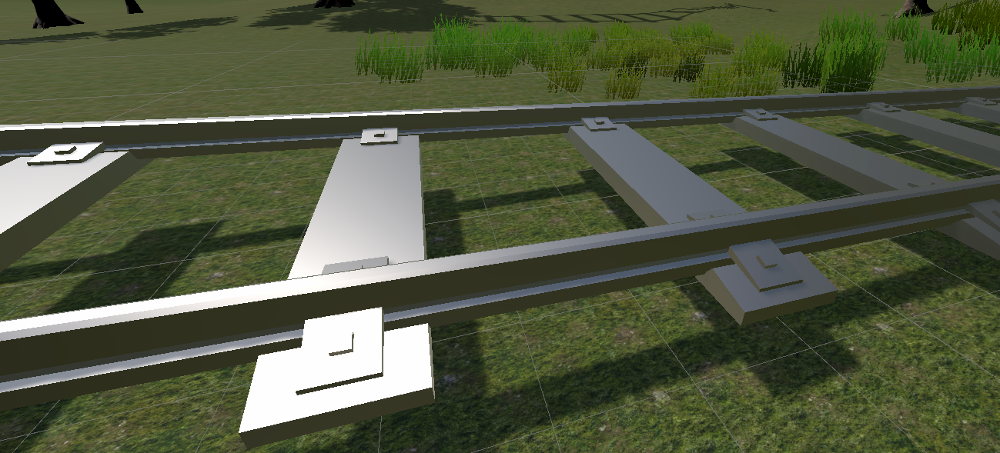

# rollercoaster-simulation
A rollercoaster simulation game created using Unity as part of my attempt to dive in the world of computer graphics. The scripts were made in C# and the assets used were downloaded online. The simulation has camera controls – ability to view in 1st and 3rd person Point-of-View, pan camera – and movement controls: ability for car to stop and move.

1. [Simulation Demo Video](#simulation-demo-video)
2. [Purpose](#purpose)
3. [Features](#features)
4. [Implementation](#implementation)
5. [User Controls](#user-controls)
6. [Snippets from the Simulation](#snippets-from-the-simulation)

## Simulation Demo Video
Click [here](https://youtu.be/ClpeL52k9Sk) to watch a demo video of this project!

## Purpose 
The aim of this project is to create a rollercoaster simulation. The simulation is meant to mimic a Virtual Reality rollercoaster simulation where the user experiences what it is like to ride on an actual rollercoaster. The simulation **will not cover the entire rollercoaster track path, but only a small section of it**.

This simulation may be useful for people who, in real life, cannot ride rollercoasters but would like to experience it from a rider’s point of view. The simulation would also be useful in the process of designing rollercoaster tracks as the designers would be able to test how the tracks translates in an actual rollercoaster ride.

## Features
### Basic features:
-	Scaling, sculpting, texturing the terrain (grass only)	(Texturing)
-	Moving rollercoaster car					                      (Animation, user control)
-	Cameras follow rollercoaster car				                (Camera controls)
-	Place and orient model for rollercoaster car		        (Transformation)
-	Directional light from sun with shadows			            (Lighting and Shadows)
-	Texturing the rollercoaster car				                  (Texturing)

### Advanced features:
-	Improving terrain textures (adding more textures)	      (Texturing)
-	Adding trees and grass					                        (Props, Level of Detail)
-	Adding reflective shaders for rollercoaster car 		    (Lighting and Texturing)
-	Adding a pond						                                (Water)
-	Switch cameras and pan in first person POV		          (Camera control)

## Implementation
The project was created using Blender (version 2.8), a free and open-source 3D computer graphics software, as well as Unity (version 2019.3), a real-time development platform that allows users to create games, simulations, visualizations, etc.

## External Assets
- Standard Assets Package – for building terrain and adding terrain props, from the Unity Asset Store
- Example Assets Package – for some of the material textures, from the Unity Asset Store
- Path Creator Package – for creating paths for the rollercoaster car and cameras, from the Unity Asset Store
- Rollercoaster Car Blend File – from https://www.blendswap.com/blend/18587
- Rollercoaster Track – the starting point used to make the entire track model, downloaded from https://www.blendswap.com/blend/9537

## User Controls
The user controls are:

- **'c'**: press to switch cameras
- **'spacebar'**: hold to stop rollercoaster car from moving (intended to let the user see whether the shader properties applied work, such as grass moving and water motions)
- **'Ctrl' + mouse movement**: lets the user pan the camera when in 1st person POV camera mode

## Snippets from the Simulation

1st POV from primary camera:

3rd POV from secondary camera:

Tracks' texturing:

